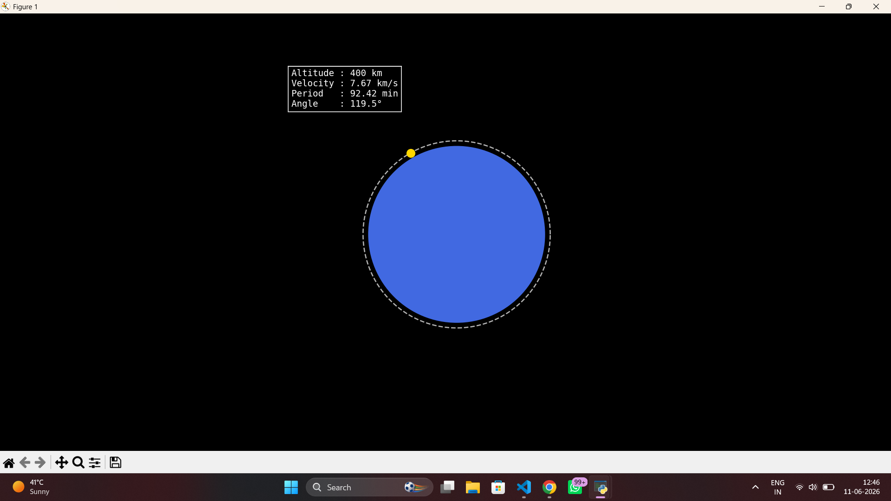

# Orbital Mechanics Mission Planner

A physics-based orbital mechanics simulator built in Python for calculating and visualizing satellite motion around Earth.

## Simulation Preview



## Features

* Calculate orbital velocity
* Calculate escape velocity
* Calculate orbital period
* Visualize circular Earth orbits
* Animate satellite motion
* Display real-time orbital telemetry

## Physics Concepts

This project implements classical orbital mechanics using Newtonian gravitation.

The simulator calculates:

* Orbital Radius
* Orbital Velocity
* Escape Velocity
* Orbital Period
* Angular Velocity

These quantities are then used to generate and animate realistic satellite motion around Earth.

## Project Structure

```text
orbital-mechanics-mission-planner/
│
├── assets/
│   └── orbit_simulation.png
│
├── physics/
│   ├── orbital_calculations.py
│   └── orbit_visualization.py
│
├── main.py
├── requirements.txt
└── README.md
```

## Installation

Clone the repository:

```bash
git clone https://github.com/jatinxvats/orbital-mechanics-mission-planner.git
```

Install dependencies:

```bash
pip install -r requirements.txt
```

Run:

```bash
python main.py
```

## Example

Input:

```text
400
```

Output:

```text
Orbital Radius: 6771.00 km
Orbital Velocity: 7.67 km/s
Escape Velocity: 10.85 km/s
Orbital Period: 92.42 minutes
```

## Future Improvements

* Geostationary orbit simulation
* Orbit comparison mode
* Hohmann transfer visualization
* Multi-satellite simulation
* Mission planning tools

## Author

Jatin Vats
